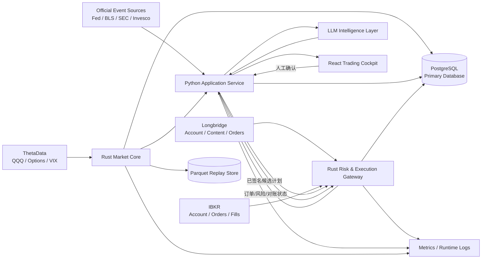
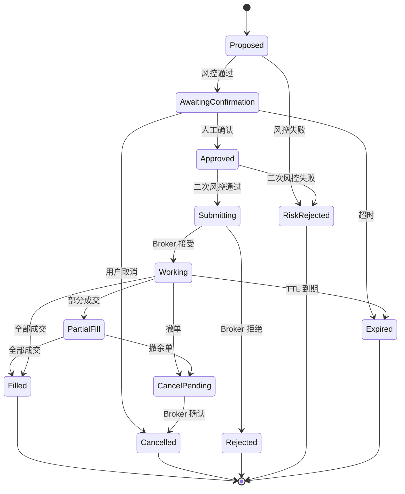

# QQQ 日内期权波动率交易系统开发计划

> 文档版本：v0.3  
> 日期：2026-07-20  
> 前端：React + TypeScript  
> 后端：Python + Rust  
> 目标：从离线研究与回放开始，逐步交付实时驾驶舱、半自动订单计划和受控自动执行

## 1. 文档目的

本文档把以下已有设计转化为可执行的软件开发计划：

- `QQQ_INTRADAY_VOL_TRADING_SYSTEM_DESIGN.md`
- `EXTERNAL_DATA_INTERFACE_PLAN.md`
- `LLM_SOP_FLOWCHARTS.html`

系统只服务于 QQQ 日内期权波动率交易，第一阶段以数据质量、可解释信号、硬风控、回放能力和人工确认闭环为目标。自动执行必须在长期 shadow/paper 验证完成后单独启用。

### 1.1 跨文档一致性基线

四份文档使用同一套职责和术语：

```text
Market Data Truth = ThetaData
Event Context = 官方事件源 + Longbridge 内容数据
Execution Truth = 当前交易计划选定 Broker 的账户、订单、成交和持仓回报
Decision Layer = Python Regime / Vol / Strategy
Authoritative Risk = Rust Risk & Execution Gateway
Human Interface = React Trading Cockpit
LLM = 解释、审核、复盘和研究假设，不拥有交易授权
Primary Database = PostgreSQL
Replay/Research Files = Parquet；DuckDB 仅用于本地只读研究
```

Longbridge 和 IBKR 都可作为 Broker Adapter，但每个 `CandidateTradePlan` 必须明确唯一 `broker_id`，一次计划只能提交给一个 Broker。其他文档若描述业务规则、外部数据或可视化流程，均以本节的职责边界和本文档的实现架构为准。

## 2. 开发原则

### 2.1 安全原则

```text
Rust Risk & Execution Gateway > Python Strategy Engine > LLM > React UI
```

- Rust Risk & Execution Gateway 是所有开仓请求的最终权威。
- Python、LLM 和 React 只能提出候选交易，不能绕过硬风控。
- 数据缺失、时钟异常、行情陈旧、Broker 状态不一致时默认 fail closed。
- 所有订单必须具备幂等键、最大风险、失效时间和人工确认状态。
- MVP 不允许裸卖 0DTE，不允许自动提高仓位，不允许自动修改硬风控参数。
- 回放、模拟、纸面交易和实盘必须使用相同的领域模型与风控接口。

### 2.2 工程原则

- 单一数据口径：ThetaData 是行情事实源；当前计划选定 Broker 的账户、订单、成交和持仓回报是执行事实源。
- 单一主数据库：PostgreSQL 是生产系统唯一事务型持久化数据库，不以 SQLite、DuckDB 或浏览器存储替代。
- 契约优先：跨语言结构先定义 Schema，再实现服务。
- UTC 存储、ET 决策、用户时区展示；禁止使用无时区时间戳。
- 每个信号、交易计划、风控判断和 LLM 输出均可追溯到输入快照与规则版本。
- 先建立确定性规则基线，再引入 LLM 解释和规则研究。
- 任何参数优化必须执行时间序列切分、walk-forward 和样本外验证。

## 3. 技术架构

### 3.1 总体架构



### 3.2 语言职责边界

| 层 | 技术 | 主要职责 | 不承担的职责 |
|---|---|---|---|
| Web UI | React + TypeScript | 驾驶舱、图表、告警、人工确认、复盘界面 | 不保存密钥，不做权威风控，不直连 Broker |
| Application Service | Python + FastAPI | SOP 编排、Regime/Vol/Strategy、事件上下文、回放、研究、LLM、Web API | 不直接绕过 Rust Risk & Execution Gateway 下单 |
| Market Core | Rust + Tokio | ThetaData 实时流、标准化、去重、时间排序、底层增量特征、行情健康度 | 不做 Regime/Strategy 决策或非确定性的 LLM 判断 |
| Risk & Execution Gateway | Rust | 硬风控、订单状态机、Broker 适配、幂等、撤改单、对账、kill switch | 不接受缺少审计上下文的自由文本指令 |
| Research Jobs | Python | 历史导入、参数研究、walk-forward、报告生成 | 不直接修改生产规则 |

选择该边界的原因：Python 适合研究、决策层指标、SOP 编排和 LLM；Rust 适合长连接、底层增量特征、低延迟状态机、并发数据处理和安全关键执行。ThetaData v3 官方本地 Python/gRPC SDK 由 Python Research Job 用于历史下载，但进入交易许可链的标准化记录、DataHealth、bar、VWAP、ATM、straddle、spread、quote age 等确定性底层特征以 Rust Market Core 为唯一权威；Python 可保留离线参考实现用于独立 fixture 对拍。Python 基于 Rust 快照生成 `VolState`、`RegimeState`、`Signal` 和 `CandidateTradePlan`。跨语言通信使用服务契约，第一版不引入 Python/Rust FFI。

### 3.3 服务划分

第一阶段采用三个可独立启动的服务：

```text
web                 React 驾驶舱
application-api     Python FastAPI + 策略/回放/LLM
trading-core        Rust 行情核心 + 风控执行网关
```

`trading-core` 初期作为单一 Rust 进程部署，但内部必须按 crate 隔离 Market、Risk、Execution、Broker Adapter。实时负载或故障域需要独立扩展时，再拆成 `market-core` 和 `execution-gateway` 两个进程。

### 3.4 通信方式

- React -> Python：HTTPS REST + WebSocket。
- Python -> Rust：gRPC；实时行情和状态使用 server streaming。
- Rust/Python -> PostgreSQL：唯一生产主数据库，保存事务状态、审计、配置版本、聚合快照和查询数据。
- 历史 tick/quote/option 快照：按日期和数据类型写入 Parquet。
- DuckDB 仅用于本地读取 Parquet 做研究，不承担生产写入、订单状态或审计职责。
- 第一阶段不强制引入消息队列；当需要多消费者、断点重放或水平扩展时引入 NATS JetStream。
- API 契约使用 Protobuf；持久化和 LLM 边界使用 JSON Schema/Pydantic；前端客户端由 OpenAPI 自动生成。

## 4. 推荐项目结构

```text
OptionTrader/
├── apps/
│   └── web/                       # React + TypeScript
├── services/
│   ├── application-api/           # Python FastAPI
│   └── trading-core/              # Rust workspace
├── packages/
│   ├── contracts/                 # Protobuf / JSON Schema / OpenAPI
│   ├── ui/                        # 可复用 UI 组件
│   └── config/                    # 非敏感共享配置模板
├── data/
│   ├── events/                    # 宏观、持仓、财报、新闻事件 JSON
│   ├── replay/                    # 本地 Parquet，仅保留目录说明
│   └── fixtures/                  # 可提交的脱敏测试数据
├── migrations/                    # PostgreSQL 迁移
├── infra/
│   ├── docker/                    # 本地开发镜像
│   ├── compose/                   # 本地依赖编排
│   └── monitoring/                # 指标和告警配置
├── scripts/                       # 开发、导入、回放、契约生成脚本
├── tests/
│   ├── contract/
│   ├── integration/
│   ├── replay/
│   └── e2e/
├── docs/
│   ├── adr/                       # 架构决策记录
│   ├── runbooks/                  # 开盘、故障、停机、恢复手册
│   └── api/
├── DEVELOPMENT_PLAN.md
├── QQQ_INTRADAY_VOL_TRADING_SYSTEM_DESIGN.md
├── EXTERNAL_DATA_INTERFACE_PLAN.md
└── LLM_SOP_FLOWCHARTS.html
```

## 5. 组件设计

### 5.1 React 驾驶舱

推荐基础技术：React、TypeScript、Vite、TanStack Query、Zustand、React Router、轻量金融图表组件、生成式 OpenAPI Client。

核心页面：

1. `Live Cockpit`
   - QQQ 分钟图、VWAP、开盘区间、盘前高低和隐含移动边界。
   - ATM straddle、ATM IV、IV/HV、Realized/Implied、VIX。
   - Regime、当前剧本、Data Health、Risk Flags 和交易许可状态。
   - 候选交易、SOP 检查、人工确认倒计时。

2. `Positions & Orders`
   - Broker 账户汇总、持仓 Greeks、最大损失、订单状态、成交和撤单。
   - 明确区分 `Proposed / Awaiting Confirm / Submitted / Partial / Filled / Cancelled / Rejected`。

3. `Replay`
   - 选择交易日和回放速度。
   - 在同一时间轴展示行情、状态变更、信号、候选订单和 LLM 解释。
   - 支持暂停、逐帧和跳转到事件点。

4. `Daily Review`
   - 交易与未交易信号、MFE/MAE、滑点、SOP 违规和 LLM 复盘。

5. `System Health`
   - 数据延迟、断流、Broker 连接、时钟漂移、服务状态、kill switch。

前端交互约束：

- `Confirm Trade` 必须展示结构、最大损失、限价、失效条件和确认截止时间。
- 高风险操作使用二次确认；kill switch 使用独立权限。
- 断线后 UI 立即进入只读状态，禁止凭本地缓存提交订单。
- 服务端序列号落后或快照过期时展示 `STALE`，并移除可交易状态。
- 浏览器中不得存储 ThetaData、Longbridge、IBKR 或 LLM 密钥。

### 5.2 Python Application Service

推荐基础技术：Python、FastAPI、Pydantic、SQLAlchemy、Alembic、Polars/Pandas、NumPy/SciPy、PyArrow、任务调度器；DuckDB 仅作为本地 Parquet 只读研究工具。

内部模块：

```text
api              REST/WebSocket/BFF
domain           领域模型和枚举
orchestration    SOP 状态机与交易日会话
regime           Trend/Range/Event/Chaos/No Trade
volatility       HV/IV、straddle、skew、realized/implied
strategy         Long Gamma/Short Premium/Event/No Trade
events           宏观、QQQ 持仓、财报、新闻上下文
review           信号/交易归因与日报
replay           历史事件驱动回放
research         参数研究、walk-forward、报告
llm              Prompt、Schema、guardrail、评估
adapters         Rust gRPC、数据库、事件源客户端
```

Python 输出的 `CandidateTradePlan` 必须是确定性结构，包含：

```text
plan_id / signal_id / session_id
plan_hash / broker_id / idempotency_key
strategy / direction / legs
quantity / limit policy / max slippage
max loss / take profit / stop loss / time stop
invalidation rules / expires_at_utc
rule_version / data_snapshot_ids
manual_confirmation_required
```

### 5.3 Rust Market Core

推荐基础技术：Rust、Tokio、Tonic、Serde、Tracing、SQLx（PostgreSQL）、Arrow/Parquet。

职责：

- 接入 ThetaData 的 QQQ 股票、QQQ 期权、IV、一阶 Greeks、OI、VIX 数据。
- 建立统一 `MarketEvent`，执行 symbol/expiry/strike/right 标准化。
- 使用 provider timestamp 和 receive timestamp 计算延迟。
- 处理乱序、重复、缺口、断线重连和 backfill。
- 增量维护分钟 bar、VWAP、opening range、ATM 合约与 straddle。
- 计算 bid/ask/mid、spread ratio、quote age 和 liquidity flags。
- 发布不可变快照及递增 `sequence_number`。
- 持久化原始事件索引和可回放 Parquet 数据。

数据质量状态：

```text
HEALTHY
DEGRADED
STALE
DISCONNECTED
RECONCILING
```

只在 `HEALTHY` 时允许新开仓；`DEGRADED` 是否允许减仓由 Risk Gate 明确配置。

### 5.4 Rust Risk & Execution Gateway

内部模块：

```text
risk-policy        硬规则和规则版本
initial-risk-check 候选计划进入 LLM/人工确认前的初始硬风控
final-risk-check   人工确认后、Broker 提交前的最终硬风控
order-state        订单有限状态机
broker-longbridge  Longbridge adapter
broker-ibkr        IBKR adapter/sidecar contract
reconciliation    账户、持仓、订单和成交对账
kill-switch        全局/账户/策略级停机
audit              不可变审计事件
```

必须实现的硬风控：

- 日亏损、连续亏损、暂停窗口和最大交易次数。
- 单笔最大损失、总风险敞口、最大张数和策略白名单。
- 事件前后禁开仓、尾盘禁开仓和复杂仓限制。
- 报价新鲜度、spread、Greeks/chain 完整度和行情状态。
- 订单支持市价、限价和受保护的自适应限价；市价新开仓默认闭锁。执行层强制保护价、
  最大追价、订单 TTL、重复订单和速率限制，坏报价不得退化为 touch/market。
- 0DTE 裸卖禁令、未定义最大损失的组合禁令。
- Broker buying power、margin、持仓和本地状态一致性检查。
- 交易计划过期、信号失效、规则版本落后时拒单。

两阶段风控语义固定为：

```text
Initial Risk Check:
- 在 LLM 审核和人工确认之前执行。
- 不通过则计划终止，不调用 LLM，不显示可确认按钮。

Final Risk Check:
- 在人工确认之后、Broker 提交之前立即执行。
- 重新读取最新 DataHealth、BrokerHealth、quote、事件窗口、计划 hash、账户、持仓和 buying power。
- 不通过则拒绝提交；人工确认不能覆盖该结论。
```

执行模式：

```text
REPLAY/SHADOW：不连接 Broker，不产生真实订单。
PAPER/MANUAL_CONFIRM：开仓和普通策略退出均需人工确认。
CONTROLLED_AUTO：仅对白名单策略启用自动执行和确定性保护退出。
任何模式下，LLM 都不位于止损、kill switch、撤单或平仓判断的关键路径。
```

Broker 健康状态统一为：

```text
HEALTHY / DEGRADED / DISCONNECTED / RECONCILING
```

只有 `DataHealth = HEALTHY` 且所选 Broker 的 `BrokerHealth = HEALTHY` 时允许新开仓。

订单状态机：



### 5.5 Event Context Layer

第一版按现有数据计划实现四个统一 Schema：

```text
macro_events.json
qqq_holdings.json
qqq_top20_earnings.json
qqq_top20_news_events.json
```

数据来源与责任：

| 数据 | 主来源 | 更新频率 | 失败策略 |
|---|---|---|---|
| 宏观日历 | Fed/BLS/FRED 等官方源 | 每周 + 每日校验 | P0 日历缺失时标记风险并阻止相关策略 |
| QQQ 持仓 | Invesco 官方数据 | 每日或每周 | 使用最近版本并显示 as-of |
| Top 20 财报 | 半自动维护 + 官方确认 | 每日 | 未确认事件提高风险，不伪造 BMO/AMC |
| 新闻/公告 | Longbridge + SEC/IR | 盘前和盘中 | 不作为硬方向信号，仅生成事件风险 |

所有事件必须保留 `source`、`source_timestamp_utc`、`received_at_utc`、`confidence` 和 `raw_ref`。

### 5.6 LLM Intelligence Layer

LLM 分阶段接入：

1. 盘后复盘与信号归因。
2. 盘前事件摘要和剧本说明。
3. 盘中状态变化解释。
4. 执行前 SOP 一致性审核。
5. 规则改进假设生成。

实现要求：

- 输入只使用已记录的结构化快照和带来源事件。
- 输出必须通过 JSON Schema 校验。
- `confidence` 只影响提示优先级。
- `Proceed` 不是下单授权；Rust Risk & Execution Gateway 仍执行完整 Final Risk Check。
- 超时、模型错误、Schema 错误时跳过 LLM，不阻塞减仓和平仓。
- Prompt、模型、Schema、温度和输入摘要均版本化并写入审计日志。
- 新闻文本视为不可信输入，防范 prompt injection；工具权限与执行权限隔离。
- 规则建议只能进入研究队列，通过成本回测、walk-forward、样本外、shadow/paper 和人工 Gate Review 后才能发布，并从下一交易会话起生效。

## 6. 核心数据契约

第一批必须冻结的契约：

```text
TradingSession
MarketEvent
MarketSnapshot
OptionContract
OptionQuote
OptionSnapshot
DataHealth
BrokerSnapshot
BrokerHealth
EventContext
RegimeState
VolState
RiskState
Signal
CandidateTradePlan
RiskDecision
OrderCommand
OrderEvent
FillEvent
PositionSnapshot
LLMReview
DailyReview
```

通用字段：

```text
schema_version
event_id
correlation_id
causation_id
session_id
occurred_at_utc
received_at_utc
source
source_sequence
rule_version
```

期权合约使用稳定主键：

```text
underlying + expiry + strike + right + multiplier
```

金额使用定点小数或整数最小货币单位，不使用二进制浮点做最终风险和订单金额判断。

## 7. 数据存储设计

### 7.1 PostgreSQL

PostgreSQL 是生产系统唯一主数据库。MVP 使用 PostgreSQL 原生分区、索引和事务能力，不引入其他生产数据库或额外时序数据库依赖。

Schema 划分：

```text
market     聚合行情、指标快照、DataHealth
events     宏观、持仓、财报、新闻和 EventContext
trading    交易会话、Signal、CandidateTradePlan、订单、成交和持仓
risk       RiskDecision、BrokerHealth、限额和 kill switch 事件
review     LLMReview、DailyReview 和研究报告索引
config     rule_version、系统配置和发布记录
audit      用户确认、状态转换和不可变审计事件
```

首批核心表：

```text
trading_sessions
market_snapshots
option_snapshots
event_contexts
signals
candidate_trade_plans
risk_decisions
orders
order_events
fills
position_snapshots
broker_snapshots
llm_reviews
daily_reviews
rule_versions
audit_events
```

类型与约束：

- 时间统一使用 `timestamptz` 并写入 UTC；ET 仅作为决策和展示派生值。
- 金额、价格、数量和 Greeks 使用 `numeric` 或明确缩放整数，不用浮点数做最终风险判断。
- 核心检索字段使用普通列；可变上下文和模型结果可使用 `jsonb`，但不能把订单状态全部塞进 JSON。
- `plan_id`、`signal_id`、`order_id`、`event_id` 和 `idempotency_key` 建立唯一约束。
- `orders`、`fills`、`risk_decisions`、`audit_events` 的写入必须和状态转换处于同一事务或使用 transactional outbox。
- 高频聚合表按 `trading_date` 分区；索引优先覆盖 `session_id`、`occurred_at_utc`、`symbol` 和状态字段。
- Alembic 是唯一 schema migration 权威；Rust SQLx 只消费已迁移 schema 和离线查询元数据，不维护第二套迁移。生产环境只允许 CI/CD 迁移任务执行 DDL。

### 7.2 Parquet

存储：

- ThetaData 原始/标准化 tick、quote、trade、option snapshot。
- 可重放的事件流。
- 研究特征与样本外测试集。

按 `provider/data_type/symbol/trading_date/hour` 分区。禁止把大量 tick 数据直接提交到 Git。

Parquet 不是事务数据库，也不是订单或风控事实源。PostgreSQL 保存数据集清单、路径、checksum、覆盖时段和导入状态，保证回放可追溯。

### 7.3 数据保留与可重复性

- 每次回放记录数据版本、规则版本和代码 commit。
- 原始数据只追加，修正数据产生新版本。
- 交易审计日志不可原地修改；更正使用补偿事件。
- 开发 fixture 必须脱敏且体积可控。
- PostgreSQL 执行自动备份、恢复演练和迁移前备份；RPO/RTO 在进入 paper 前明确。

## 8. API 计划

### 8.1 React 使用的 HTTP API

```text
GET  /api/v1/session/current
GET  /api/v1/dashboard/snapshot
GET  /api/v1/events/today
GET  /api/v1/signals
GET  /api/v1/trade-plans/{id}
POST /api/v1/trade-plans/{id}/confirm
POST /api/v1/trade-plans/{id}/cancel
GET  /api/v1/orders
GET  /api/v1/positions
GET  /api/v1/risk/status
POST /api/v1/risk/kill-switch
GET  /api/v1/replays
POST /api/v1/replays
GET  /api/v1/reviews/{trading_date}
```

WebSocket 主题：

```text
market.snapshot
regime.state
vol.state
risk.state
signal.created
trade_plan.updated
order.updated
position.updated
system.health
```

### 8.2 Python 与 Rust 的 gRPC API

```text
StreamMarketSnapshots
GetDataHealth
EvaluateRisk
SubmitApprovedPlan
CancelOrder
ClosePosition
StreamOrderEvents
GetBrokerSnapshot
ReconcileState
ActivateKillSwitch
```

`SubmitApprovedPlan` 必须携带人工确认令牌、确认时间、计划 hash、规则版本和过期时间。

## 9. 配置与规则管理

配置分为三类：

| 类型 | 示例 | 发布要求 |
|---|---|---|
| 硬风控 | 日亏损、最大张数、禁交易窗口 | 双人/显式批准、版本化、不可被 LLM 修改 |
| 策略参数 | Trend Score、IV/HV 阈值、time stop | 回测 + 样本外 + paper 验证 |
| 展示参数 | 图表周期、告警声音 | 普通配置发布 |

每个生产规则包包含：

```text
version
effective_from
author
approval
change_reason
backtest_report_id
paper_report_id
checksum
```

交易日开始后冻结核心规则版本；盘中只允许触发更严格的风险覆盖，不允许放宽。

## 10. 测试与验证策略

### 10.1 单元测试

- Python：指标、评分、状态转换、事件窗口、策略选择、LLM Schema。
- Rust：行情去重排序、定点金额、风险规则、订单状态机、幂等和对账。
- React：状态展示、过期计划、断线只读、确认交互。

### 10.2 契约测试

- Protobuf 向后兼容检查。
- OpenAPI 生成客户端编译检查。
- Python/Rust 对同一 fixture 的金额、时间和枚举解释一致。
- Broker adapter 使用统一认证、错误和订单语义映射。

### 10.3 回放测试

至少覆盖以下交易日场景：

```text
正常趋势日
低波动震荡日
高开/低开缺口日
CPI/FOMC 事件日
事件后 IV crush
午间低流动性
尾盘 gamma 加速
ThetaData 断流/乱序/陈旧报价
Broker 部分成交/拒单/断线
连续亏损和日亏损停机
```

### 10.4 策略研究验证

- 严格按日期切分训练、验证和样本外测试。
- 使用 rolling walk-forward，不随机打乱时间序列。
- 计入 bid/ask、手续费、部分成交、订单 TTL 和滑点。
- 输出 IS/OOS 衰减；OOS 表现显著低于 IS 时标记过拟合。
- 评估 No Trade 的机会成本与风险规避效果。
- 参数选择优先稳定区间，不选择孤立最优点。

### 10.5 LLM 评估

- SOP 冲突识别率、误报率、漏报风险数。
- 结构化输出成功率、延迟、成本和不可用率。
- 对同一输入的稳定性和规则引用正确率。
- 注入攻击、无来源新闻、矛盾上下文和缺失数据测试。
- LLM 不可用时系统核心交易流程仍能运行。

### 10.6 上线门槛

```text
实时驾驶舱：连续 5 个交易日数据完整率达标，无未解释状态漂移。
半自动：至少 20 个交易日 shadow，风险拒单与人工复核一致。
Paper：至少 20-40 个交易日，覆盖趋势、震荡和事件日。
受控实盘：独立批准，小仓位，限定策略，随时 kill switch。
自动执行：满足设计文档要求的 1-2 个月以上日志，并通过专项安全审查。
```

具体收益指标不是唯一上线条件；数据完整性、风控正确性、可恢复性和审计完整性拥有否决权。

## 11. 可观测性与运行手册

关键指标：

```text
market_event_lag_ms
quote_age_ms
out_of_order_count
theta_reconnect_count
snapshot_publish_lag_ms
risk_evaluation_latency_ms
order_submit_latency_ms
broker_reject_count
position_reconciliation_diff
llm_latency_ms
websocket_client_lag
```

关键告警：

- 行情超过阈值未更新。
- Provider 与本地时钟偏差异常。
- Broker 持仓/订单与本地账本不一致。
- 连续风险拒单、连续滑点异常或日亏损触发。
- 服务重启后未完成对账却出现开仓请求。
- LLM Schema 错误或输入来源不完整。

必须编写的 runbook：

```text
盘前启动检查
ThetaData 断线恢复
Broker 断线与订单状态不明
持仓对账不一致
kill switch 启用和解除
数据库/服务恢复
交易日结束和审计归档
```

## 12. 安全与权限

- 密钥使用本地 secret store 或部署环境密钥管理，不进入 Git、日志和前端 bundle。
- 开发、paper、实盘使用独立配置和明确视觉标识。
- 实盘 API 默认禁用，需显式环境开关和启动检查。
- 权限分为 Viewer、Trader、Risk Admin；kill switch 解除权限高于启用权限。
- 所有确认、规则变更、停机和恢复操作写入审计日志。
- 日志对账户号、token、订单原始凭证和个人信息脱敏。
- 依赖执行 lockfile、漏洞扫描和许可证检查。

## 13. CI/CD 与开发工作流

### 13.1 持续集成

每个变更必须通过：

```text
TypeScript lint / typecheck / unit tests / production build
Python lint / typecheck / unit tests
Rust fmt / clippy / unit tests
Protobuf/OpenAPI compatibility checks
database migration checks
contract and replay smoke tests
secret scan and dependency audit
```

### 13.2 环境

```text
local       本地模拟和 fixture
replay      历史数据回放
shadow      实时数据、只生成信号，不生成可提交订单
paper       Broker 模拟账户
live        受控实盘，默认关闭
```

环境切换不得只依赖前端参数；Rust Gateway 必须验证服务端环境和账户白名单。

## 14. 分阶段开发计划

以下工期按一名主开发者配合自动化开发工具估算，实际以验收条件为准。

### Phase 0：工程基础与契约（3-5 个工作日）

任务：

- 建立 monorepo、React/Python/Rust 工程和统一命令入口。
- 配置 lint、format、typecheck、test、pre-commit 和 CI。
- 建立 Protobuf、JSON Schema、OpenAPI 生成流程。
- 完成 PostgreSQL、Alembic 单一迁移链、SQLx 离线元数据、Parquet 和本地 compose 基础。
- 建立环境配置、密钥模板和日志规范。

验收：

- 三个服务可本地启动并通过 health check。
- 一个示例快照可从 Rust 经 Python 推送到 React。
- PostgreSQL migration 可在空库升级、回滚开发迁移并通过约束测试。
- 禁止提交密钥和本地大数据文件。

### Phase 1：历史数据与离线回放（2 周）

任务：

- Python Research Job 通过 ThetaData 官方 Python/gRPC SDK 下载历史 QQQ/期权/VIX。
- Rust Market Core 权威标准化 Market/Option 数据；Python 兼容作业写入带 manifest/checksum 的离线 Parquet。
- 实现 VWAP、opening range、HV20/HV60、ATM、straddle、spread。
- 实现确定性回放时钟和事件驱动管线。
- 实现 Regime、Vol、Risk、Strategy 初版。
- 记录所有信号和 No Trade 原因。

验收：

- 任意已导入交易日可重复回放，结果 hash 一致。
- 关键指标与独立计算 fixture 一致。
- 至少覆盖趋势、震荡、事件和数据故障场景。
- 不连接实盘下单接口。

### Phase 2：事件上下文与实时驾驶舱（2 周）

任务：

- 接入/导入宏观事件、QQQ 持仓、Top 20 财报和新闻公告。
- 实现实时 ThetaData 流、健康监控和断线重连。
- 完成 Live Cockpit、System Health、信号日志和 Risk Flags。
- WebSocket 增量推送与快照恢复。

验收：

- 实时状态变化可在 UI 追溯到行情快照和规则。
- 数据陈旧或断流后 UI 和服务端均进入禁开仓状态。
- 连续运行一个完整交易日，无未处理异常。

### Phase 3：候选交易与半自动闭环（2-3 周）

任务：

- CandidateTradePlan、仓位计算和 SOP 检查。
- Candidate 计划级与每腿 quote/Greeks/chain proof 强制来自 ThetaData，并进入 hash。
- Rust 硬风控、订单状态机、幂等与审计。
- Longbridge/IBKR 账户、持仓、订单和成交适配。
- Longbridge 无原生 combo 时由 Rust BUY-first 逐腿确认；IBKR 优先使用 BAG。
- UI 人工确认、超时、取消和订单状态展示。
- 先接 paper/shadow，实盘提交开关保持关闭。

验收：

- 同一计划重复提交不会产生重复订单。
- 部分成交、拒单、撤单、断线恢复和对账测试通过。
- 父单及每个 Broker 子单的委托量、成交量、状态和残余敞口可独立审计；任何回退或
  无终态证明的残仓清除必须 fail closed。
- 所有订单可追溯到 signal、snapshot、规则版本和用户确认。
- 任一非 ThetaData 行情证明、买腿未完整成交或拆腿状态未知都禁止提交卖腿。

### Phase 4：LLM 辅助与复盘（1-2 周）

任务：

- 盘后复盘、盘前摘要、盘中解释和执行前审核。
- LLM Schema、超时、重试、缓存、成本控制和评估集。
- Prompt injection 与无来源上下文防护。
- Daily Review 页面与规则改进研究队列。

验收：

- LLM 不可用时核心系统不受影响。
- LLM 输出不能直接改变硬风控或下单。
- 评估集给出冲突识别率、误报率和漏报案例。

### Phase 5：Shadow 与 Paper 验证（3-6 周，按交易日计算）

任务：

- 连续运行、监控、回放复核和数据修复。
- 对比候选限价与实际可成交价格。
- 校准滑点、TTL、spread 和状态阈值。
- walk-forward 与样本外报告。
- 完成运行手册和故障演练。

验收：

- 达到数据质量、风险正确性、对账和审计门槛。
- 无严重 SOP 绕过路径。
- 形成是否进入受控实盘的书面 Gate Review。

### Phase 6：受控实盘（单独批准）

限制：

- 仅小仓位、限定账户、限定策略、限定时段。
- 默认人工确认；自动执行按策略逐项启用。
- 每日限额和 kill switch 在 Broker 与本地双重约束。
- 首次出现状态不一致、未知订单或重大数据故障即停机。

## 15. 首批开发 Backlog

### P0：立即开始

- 初始化 monorepo 和基础工具链。
- 定义核心数据契约及版本规则。
- 建立 ThetaData 历史/实时最小适配器。
- 建立 Rust MarketEvent 管线和 DataHealth。
- 建立 Python 回放时钟、Vol/Regime/Risk 初版。
- 建立 React 驾驶舱骨架和实时快照页。
- 建立事件 JSON Schema 与测试 fixture。
- 建立审计日志、关联 ID 和规则版本。

### P1：MVP 完成前

- 候选交易生成、订单状态机和 Broker paper adapter。
- 账户/持仓/订单对账。
- Daily Review 和信号质量报告。
- LLM 盘后与盘前功能。
- 故障注入、回放场景库和 runbook。

### P2：验证后

- 多腿 cancel/replace 优化、跨腿实时净价复核和动态限价策略。
- NATS JetStream 解耦实时消费者。
- 更完整的 VIX term structure、VVIX 和跨市场确认。
- LLM 盘中审核与规则研究助手。
- 受控自动执行。

## 16. 暂不实现

- 裸卖 0DTE straddle/strangle。
- LLM 直接生成并提交 Broker 原生订单。
- 自动上线 LLM 建议的规则。
- 多标的泛化和组合级跨资产优化。
- 高频做市、微秒级撮合或 co-location 架构。
- 第一阶段引入 Kubernetes、复杂消息总线或多区域部署。

## 17. 关键风险与缓解

| 风险 | 后果 | 缓解措施 |
|---|---|---|
| ThetaData 并发/数据边界 | 快照缺失或延迟 | Rust 限流、缓存、流优先、批量请求、健康状态 |
| Python/Rust 双实现漂移 | 回放与实盘结果不同 | 契约测试、golden fixtures、单一权威计算归属 |
| Broker 状态不一致 | 重复单或裸露仓位 | 幂等键、启动对账、未知状态禁开仓 |
| 0DTE 滑点和 Gamma | 实际亏损超模型 | 限价、TTL、defined-risk、spread/quote-age 门槛 |
| 事件数据不完整 | 错误进入 short premium | P0 日历校验、缺失即提高风险或禁用策略 |
| LLM 幻觉/注入 | 错误解释或风险遗漏 | 结构化输入输出、来源验证、无执行权限、评估集 |
| 参数过拟合 | 样本外失效 | walk-forward、成本建模、稳定区间、shadow/paper |
| 前端陈旧状态 | 用户确认已失效计划 | 服务端 TTL、二次风控、序列号和断线只读 |

## 18. MVP 完成定义

MVP 完成必须同时满足：

```text
1. 可导入并确定性回放 QQQ 股票、期权和 VIX 数据。
2. 可实时展示 Market/Vol/Regime/Risk/Event 状态。
3. 可生成 No Trade、Long Gamma、Short Premium 候选信号。
4. 可记录交易和未交易信号，并生成每日复盘。
5. 可生成候选交易，但默认不提交实盘。
6. 所有候选交易经过 Rust Risk & Execution Gateway。
7. 数据断流、报价陈旧、事件窗口和日亏损能够 fail closed。
8. LLM 只提供解释、审核和复盘，不拥有执行权限。
9. 回放、契约、故障和关键 E2E 测试通过。
10. 开发、shadow、paper、live 环境严格隔离。
```

## 19. 开工顺序

第一周按以下顺序推进：

```text
Day 1：monorepo、工具链、环境与 CI
Day 2：Protobuf/JSON Schema、核心领域模型
Day 3：Rust ThetaData 最小适配器、MarketEvent、DataHealth
Day 4：Python 回放时钟、快照 API、数据库迁移
Day 5：React Cockpit 骨架、WebSocket 快照链路、端到端 smoke test
```

第一周结束时应看到一条真实或 fixture 行情，从 Rust 进入 Python，再实时显示在 React 页面；同时数据过期后整条链路自动切换为 `No Trade / STALE`。这将作为后续所有策略、风控和 LLM 功能的基础验收链路。

## 20. 风险声明

本文档是软件工程与研究计划，不构成投资建议。QQQ 0DTE 期权具有极高 Gamma、Theta、流动性和执行风险。系统的首要目标是阻止不可解释、不可审计或超出风险边界的交易，而不是保证盈利。
