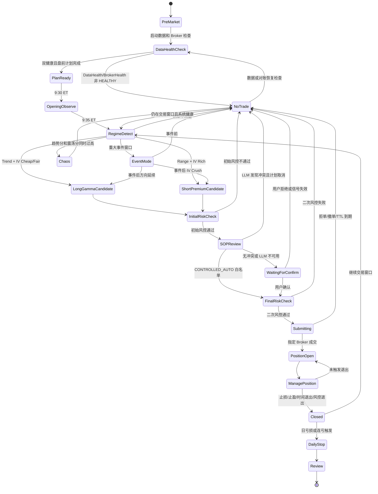
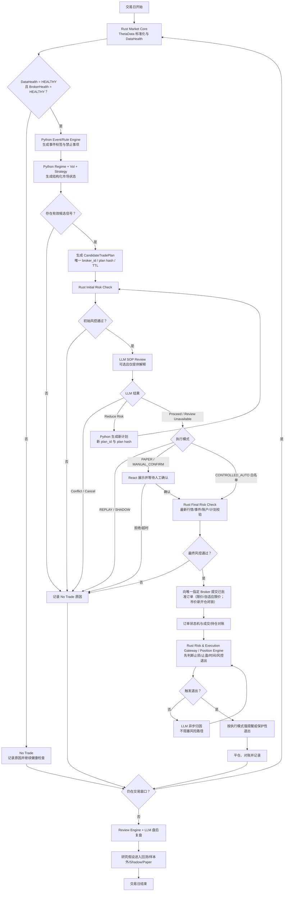
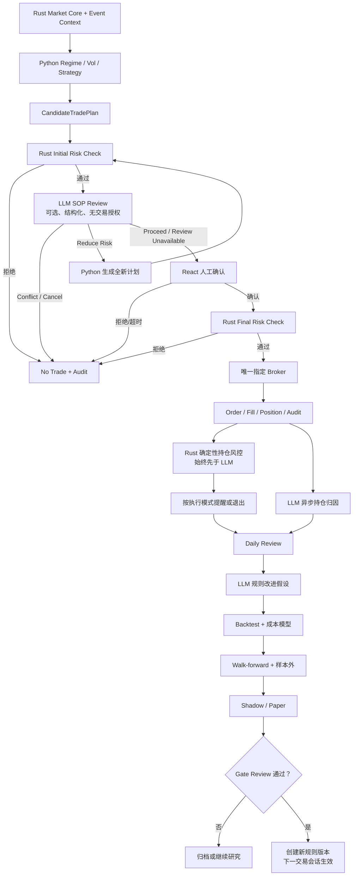

# QQQ Intraday Options Volatility Trading System Design

> 版本：v0.3
> 目标市场：美股
> 标的：QQQ.US
> 策略类型：日内期权波动率交易
> 系统定位：交易驾驶舱 + 半自动信号系统，后续可扩展为受控自动执行系统

## 0. 文档一致性基线

本文档与 `DEVELOPMENT_PLAN.md`、`EXTERNAL_DATA_INTERFACE_PLAN.md` 和 `LLM_SOP_FLOWCHARTS.html` 使用同一架构：

```text
ThetaData = Market Data Truth
官方事件源 + Longbridge 内容数据 = Event Context
当前计划选定的 Longbridge 或 IBKR = Execution Truth
Rust Market Core = 行情标准化、底层增量特征和 DataHealth
Python Application Service = Regime / Vol / Strategy / Event / Review / LLM 编排
Rust Risk & Execution Gateway = 最终硬风控、订单状态机、BrokerHealth、Broker 对账和 kill switch
React Trading Cockpit = 展示、告警和人工确认
PostgreSQL = 生产系统唯一主数据库
Parquet = 原始行情和回放文件；DuckDB 仅用于本地只读研究
```

每个 `CandidateTradePlan` 必须指定唯一 `broker_id`，不得同时向 Longbridge 和 IBKR 提交。同一业务概念在四份文档中使用相同名称和权限边界。

## 1. 设计目标

本系统面向专一交易 QQQ 日内期期权波动率的交易员，目标不是预测 QQQ 的长期方向，而是判断盘中实际波动是否相对期权隐含波动出现错配，并将交易流程标准化、量化和可复盘。

第一阶段不直接追求全自动下单，而是构建一个可以持续输出交易状态、波动率判断、剧本选择、风控结论和复盘数据的交易驾驶舱。

核心问题：

- 今天是否适合交易？
- 当前更适合做 Long Vol 还是 Short Vol？
- 是否满足入场条件？
- 该选什么结构？
- 当前持仓是否应该止损、止盈、减仓或退出？
- 是否触发禁交易条件？
- 交易结果来自策略判断、执行质量，还是违反 SOP？

## 2. 非目标

系统第一阶段不做以下事项：

- 不做无人工确认的全自动裸卖 0DTE 期权。
- 不做长期持仓建议。
- 不做多标的泛化策略。
- 不做新闻语义预测方向交易。
- 不做不可解释的黑箱信号。
- 不允许突破风控限制继续交易。

## 3. 交易理念

QQQ 日内期期权的核心风险来自 Gamma、Theta、IV 变化和盘口滑点。系统必须优先判断交易环境，而不是直接输出买 Call 或买 Put。

交易逻辑顺序：

1. 判断是否有重大事件。
2. 判断 IV 贵贱与盘口质量。
3. 判断市场状态：趋势、震荡、事件后、混乱。
4. 选择波动率交易剧本。
5. 通过风控过滤。
6. 生成候选交易。
7. 管理持仓。
8. 记录并复盘信号质量。

一句话原则：

```text
不要让系统预测 QQQ，而是让系统判断当前波动率交易环境是否值得下注。
```

## 4. 系统分层

系统由以下模块组成：

```text
Rust Market Core
Python Application Service
  - Event Context Layer
  - Regime Engine
  - Vol Engine
  - Strategy Engine
  - Review Engine
  - LLM Intelligence Layer
Rust Risk & Execution Gateway
React Trading Cockpit
```

### 4.1 Rust Market Core / Data Engine

负责获取、清洗、对齐实时和历史数据。

输入：

- QQQ 实时报价
- QQQ 分钟 K 线
- QQQ 期权链
- ATM IV
- Option Greeks
- Bid/Ask/Mid
- Option volume
- Call/Put volume ratio
- 开盘价、昨高、昨低、昨收
- 盘前高低点
- VWAP
- 宏观事件日历标签

输出：

- 标准化行情快照
- 标准化期权链
- ATM 合约识别结果
- 开盘区间
- 关键价位
- 实时波动率指标
- `DataHealth`：`HEALTHY / DEGRADED / STALE / DISCONNECTED / RECONCILING`

职责边界：Rust 负责 bar、VWAP、opening range、ATM、straddle、spread、quote age 等确定性底层特征；Python 基于这些快照生成 `VolState`、`RegimeState` 和策略决策，避免跨语言重复实现同一规则。

### 4.2 Rust Risk & Execution Gateway / Risk Engine

负责所有硬风控和禁交易判断。

硬规则：

```text
1. 单日最大亏损达到账户净值 1%-2%，停止交易。
2. 连续亏损 2 笔，暂停 30 分钟。
3. 连续亏损 3 笔，当日停止交易。
4. 重大数据公布前后 5 分钟禁止新开仓。
5. 15:30 ET 后禁止新开复杂仓。
6. 15:45 ET 后禁止新开任何仓，只允许减仓或平仓。
7. ATM option bid-ask spread > mid 价格 10%，禁止交易。
8. 期权链报价异常、Greeks 缺失或延迟，禁止交易。
9. 未生成主剧本，禁止交易。
10. 价格处于 VWAP 附近无方向区，禁止方向性追单。
11. DataHealth 不为 HEALTHY，禁止新开仓。
12. BrokerHealth 不为 HEALTHY，或账户、订单、持仓与本地账本未完成对账，禁止新开仓。
13. CandidateTradePlan 已过期、plan hash 不匹配或规则版本落后，禁止提交。
14. 一个 CandidateTradePlan 只能提交给其指定的唯一 broker_id。
15. 行情、期权报价、Greeks、期权链及执行定价证明不是 ThetaData，禁止提交。
16. Longbridge 拆腿时，所有 BUY 保护腿未确认完整成交前，禁止提交任何 SELL 腿；partial 或 unknown 立即进入残仓/对账状态。
17. 保护性 CLOSE 必须由最新已提交 Broker native 持仓证明方向相反且数量不超限；没有持仓证明不得提交。
18. 市价单只允许单腿保护性 CLOSE；市价新开仓和多腿市价平仓固定禁止。
```

风控必须执行两次：

```text
Initial Risk Check：候选计划进入 LLM 审核和人工确认之前执行。
Final Risk Check：人工确认之后、Broker 提交之前立即执行。

Final Risk Check 必须重新读取：
- 最新 DataHealth、BrokerHealth 和 quote age
- 最新 spread、事件窗口和信号失效条件
- plan hash、expires_at 和 rule_version
- 指定 Broker 的账户、持仓、订单、margin 和 buying power

人工确认和 LLM Proceed 都不能覆盖 Final Risk Check。
```

Broker 健康状态统一为：

```text
HEALTHY / DEGRADED / DISCONNECTED / RECONCILING
```

### 4.3 Regime Engine

负责识别市场状态。

市场状态：

- Trend
- Range
- Event
- Chaos
- No Trade

趋势分：

```text
+2 QQQ 位于 VWAP 上方或下方并持续超过 10 分钟
+2 突破开盘 15 分钟区间
+1 成交量高于过去 20 日同时间均值
+1 回踩 VWAP 或突破位后继续同向
+1 ATM straddle 价格上涨
```

震荡分：

```text
+2 价格反复穿越 VWAP 超过 3 次
+2 开盘区间高低点都未延续
+1 成交量下降
+1 ATM straddle 价格持续下跌
+1 K 线实体变小、影线增多
```

分类规则：

```text
Trend Score >= 5 且 Range Score < 4：Trend
Range Score >= 5 且 Trend Score < 4：Range
Trend Score >= 5 且 Range Score >= 5：Chaos
存在重大定时事件窗口：Event
其他情况：No Trade
```

### 4.4 Vol Engine

负责判断隐含波动和实际波动关系。

核心指标：

- ATM IV
- 20 日历史波动
- 60 日历史波动
- IV/HV ratio
- 0DTE ATM straddle price
- Implied intraday move
- Realized intraday move
- Realized/Implied move ratio
- Straddle expansion/decay
- Put skew / Call skew

计算：

```text
Implied Intraday Move = ATM Straddle Price / QQQ Spot

Realized Intraday Move = max(
  abs(Current Price - Open Price),
  abs(Current Price - Intraday High),
  abs(Current Price - Intraday Low)
) / QQQ Spot

Realized/Implied Ratio = Realized Intraday Move / Implied Intraday Move
```

波动率状态：

```text
IV/HV < 0.8：IV Cheap
0.8 <= IV/HV <= 1.2：IV Fair
IV/HV > 1.2：IV Rich
IV/HV > 1.5：IV Very Rich
```

日内解释：

```text
Realized/Implied < 0.4 且 Straddle 衰减：Short Vol 倾向
Realized/Implied > 0.6 且继续突破：Long Vol 倾向
Realized/Implied 接近 1 且 IV 不扩张：禁止追 Long Vol
```

### 4.5 Strategy Engine

负责根据市场状态和波动率状态选择交易剧本。

支持剧本：

- Long Gamma
- Short Premium
- Event Vol Crush
- No Trade

#### Long Gamma

适用条件：

```text
Regime = Trend
IV = Cheap 或 Fair
Straddle 不衰减，最好扩张
QQQ 突破开盘区间并放量
时间窗口为 9:45-11:00 ET 或 14:00-15:30 ET
```

可选结构：

- 买 ATM 或轻度 ITM Call/Put
- 买 0DTE Straddle
- 买 0DTE Strangle
- 买 1DTE 方向期权
- Debit Spread

合约选择：

```text
方向强：Delta 0.45-0.60
方向一般但预期扩波：ATM Straddle 或 Strangle
担心 IV 回落：Debit Spread
禁止 Delta < 0.20 的远 OTM 0DTE
禁止 bid-ask spread > 10% 的合约
```

入场触发：

```text
1. QQQ 位于 VWAP 同方向一侧。
2. 突破开盘 15 分钟高点或低点。
3. 回踩突破位不失守。
4. ATM option 未出现明显 IV 塌陷。
5. spread 合格。
6. 当前时间处于允许交易窗口。
```

撤销触发：

```text
1. 突破后 3 分钟内回到区间内。
2. spread 突然扩大。
3. QQQ 已连续单边移动超过 0.7% 且无回踩。
4. Straddle 不随标的波动扩张。
```

退出：

```text
价格止损：权利金亏损 25%-35%。
时间止损：进场后 10-15 分钟无盈利，减仓或退出。
波动率止损：标的继续同向但期权不涨，退出。
止盈：盈利 40%-70% 减半，触及隐含波动边界继续减仓。
```

#### Short Premium

适用条件：

```text
Regime = Range
IV = Rich 或 Very Rich
QQQ 反复穿越 VWAP
开盘区间无延续
Straddle 持续衰减
无重大事件临近
```

可选结构：

- Iron Condor
- Call Credit Spread
- Put Credit Spread

禁止：

- 裸卖 0DTE Straddle
- 裸卖 0DTE Strangle
- 在重大事件前卖方进场

合约选择：

```text
Short strike 位于开盘区间外。
Short strike 位于关键支撑/阻力外。
Short strike 位于隐含移动范围外。
Short strike Delta 0.10-0.25。
Long strike 用于限定最大亏损。
```

入场触发：

```text
1. 开盘至少 30-45 分钟后。
2. QQQ 未有效突破开盘区间。
3. Straddle 明显衰减。
4. VWAP 附近反复拉扯。
5. 期权 spread 合格。
6. 无未来 15 分钟重大事件。
```

退出：

```text
价格止损：亏损达到收款 1.5-2 倍。
结构止损：被挑战一侧 Delta 升至 0.35-0.40。
趋势止损：QQQ 放量突破区间。
止盈：权利金衰减 50%-70% 时平仓。
时间退出：尾盘 gamma 风险上升前主动退出。
```

#### Event Vol Crush

适用条件：

```text
存在 CPI、FOMC、非农、重要权重股财报或其他定时事件。
事件前 IV 明显抬升。
事件后方向不延续或快速回到区间。
```

规则：

```text
事件前 5 分钟禁止新开仓。
事件刚公布后不追第一根波动。
等待 bid-ask spread 收窄。
等待价格二次确认。
事件后若方向延续，转 Long Gamma。
事件后若回到区间且 IV crush，转 Short Premium。
事件后若波动混乱，No Trade。
```

### 4.6 Rust Risk & Execution Gateway / Execution Engine

Phase 3 默认只进入确定性 simulated-paper；隔离的真实 paper adapter 需要多重服务端 opt-in，
live 不存在可达路由。模式必须显式区分：

```text
REPLAY/SHADOW：不连接 Broker。
PAPER/MANUAL_CONFIRM：开仓和普通策略退出均需人工确认。
CONTROLLED_AUTO：仅对白名单策略启用自动执行和确定性保护退出。
```

候选订单内容：

```text
Strategy Type
Plan ID / Signal ID / Session ID
Plan Hash / Idempotency Key
Broker ID
Position Effect（OPEN / CLOSE）
Symbol
Expiry
Legs
Side
Quantity
Limit Price
Max Loss
Take Profit
Stop Loss
Invalidation Condition
Expires At
Rule Version / Data Snapshot IDs
Reason
Initial Risk Decision
Manual Confirmation Required
```

订单规则：

```text
所有订单必须使用限价。
限价默认以 mid 为基准。
若未成交，不追价超过预设滑点。
超过等待时间自动取消候选订单。
禁止在 spread 异常扩大时下单。
人工确认后必须执行 Final Risk Check，只有通过后才能向指定 Broker 提交。
同一 idempotency key 的重复请求不得生成重复订单。
```

持仓退出顺序：

```text
Market Core + Broker Fill/Position
→ Rust Risk & Execution Gateway / Position Engine 先执行确定性退出判断
→ 按当前执行模式生成强提醒或保护性退出动作
→ LLM 异步解释方向、IV、Theta 和滑点归因

LLM 超时、失败或 Schema 错误不得延迟止损、撤单、kill switch 或平仓。
```

执行质量评分：

```text
Execution Quality Score = f(
  actual fill vs mid,
  bid-ask spread,
  fill wait time,
  adverse move after 1 minute,
  order cancellation count
)
```

风控联动：

```text
连续 3 笔滑点超阈值：降低仓位或暂停交易。
成交后 1 分钟平均不利超过阈值：暂停该剧本。
```

### 4.7 Review Engine

复盘对象包括交易和未交易信号。

每个信号记录：

```text
signal_id
timestamp
regime
strategy_type
qqq_price
vwap
opening_range_high
opening_range_low
atm_straddle_price
atm_iv
iv_hv_ratio
realized_implied_ratio
spread_quality
risk_status
signal_action
entered_or_not
reason
```

每笔交易记录：

```text
trade_id
signal_id
timestamp_entry
timestamp_exit
legs
entry_price
exit_price
max_favorable_excursion
max_adverse_excursion
pnl
pnl_percent
slippage
exit_reason
sop_violation
```

每日复盘：

```text
今日市场类型
今日 IV 判断
出现过多少个信号
执行了多少个信号
未执行信号后续表现
最好交易
最差交易
是否违反 SOP
亏损来源：方向 / IV / Theta / 滑点 / 执行错误
明天只改一件事
```

### 4.8 LLM Intelligence Layer

LLM Intelligence Layer 负责把结构化交易数据、市场上下文、事件信息和复盘日志转化为更高层的解释、提醒和策略改进建议。LLM 不作为硬信号源，不直接绕过风控，也不直接决定自动下单。

核心定位：

```text
LLM = Context Interpreter + Playbook Explainer + Review Analyst + Rule Improvement Assistant
```

LLM 可以参与的环节：

```text
盘前：
- 总结今日宏观事件、科技股事件和风险窗口。
- 解释 Event/Rule Engine 已生成的交易日标签，例如 Event Day、High Gap Day、Normal Day。
- 解释 Python Strategy Engine 生成的盘前候选剧本和禁止事项，识别上下文冲突。

盘中：
- 解释 Regime Engine 和 Vol Engine 的状态变化。
- 判断当前信号是否与盘前剧本冲突。
- 识别异常情况，例如价格突破但 straddle 不扩张。
- 输出自然语言交易备忘，而不是直接下单。

执行前：
- 检查候选订单是否符合 SOP。
- 用文字解释该交易的收益来源、失效条件和主要风险。
- 提醒 spread、事件、时间窗口、连续亏损等风险。
- `Proceed` 只表示未发现语义冲突，不是交易授权。

持仓中：
- 根据结构化数据解释持仓表现来自方向、IV、Theta 还是滑点。
- 提醒是否触发时间止损、波动率止损或剧本失效。
- 总结当前持仓是否仍符合原始交易假设。
- 仅异步解释；确定性退出判断必须先由 Rust Risk & Execution Gateway / Position Engine 完成。

盘后：
- 自动生成交易复盘。
- 区分好亏损和坏亏损。
- 总结 SOP 违规。
- 提出下一交易日只改一件事。

策略迭代：
- 分析信号日志，发现规则过严、过松或冲突。
- 生成待验证假设。
- 不能直接上线新规则，必须进入回测或模拟验证。
```

LLM 禁止事项：

```text
1. 不允许绕过 Rust Risk & Execution Gateway。
2. 不允许直接提高仓位上限。
3. 不允许在 No Trade 状态下生成开仓指令。
4. 不允许基于模糊新闻情绪直接开仓。
5. 不允许修改硬风控参数并立即实盘生效。
6. 不允许将解释性判断伪装成确定性信号。
7. 不允许位于止损、撤单、kill switch 或平仓的关键路径。
8. 不允许选择、切换或同时提交多个 Broker。
```

LLM 输入：

```json
{
  "market_snapshot": {},
  "option_snapshot": {},
  "regime_state": {},
  "vol_state": {},
  "risk_state": {},
  "data_health": {},
  "broker_health": {},
  "active_playbook": {},
  "candidate_trade_plan": {},
  "recent_signals": [],
  "recent_trades": [],
  "event_context": {}
}
```

LLM 输出必须结构化：

```json
{
  "schema_version": "1.2",
  "review_id": "llm_review_20260720_094501",
  "plan_id": "plan_20260720_094501",
  "review_status": "COMPLETED | UNAVAILABLE | INVALID",
  "summary": "当前市场状态解释",
  "decision_support": "支持或反对当前候选交易的理由",
  "sop_alignment": "Aligned | Conflict | Unknown",
  "risk_notes": [
    "主要风险 1",
    "主要风险 2"
  ],
  "invalidations": [
    "失效条件 1",
    "失效条件 2"
  ],
  "recommended_action": "Proceed | Wait | Cancel | Reduce Risk | Review Only",
  "confidence": 0.0
}
```

LLM 置信度约束：

```text
confidence 只能影响提醒优先级，不能单独触发交易。
只有 Python Strategy Engine + Rust Initial Risk Check 同时通过时，候选订单才允许进入人工确认。
人工确认后仍必须通过 Rust Final Risk Check 才能提交 Broker。
LLM 若输出 Cancel，应取消或等待；若输出 Reduce Risk，Python 必须创建新 plan_id 与 plan hash，并重新执行 Initial Risk Check。
LLM 若超时、不可用或输出不符合 Schema，记录为 Review Unavailable；核心规则流程继续，且不得阻塞减仓和平仓。
```

推荐接入方式：

```text
LLM Stage A：盘后复盘
LLM Stage B：盘前解释
LLM Stage C：盘中异步解释
LLM Stage D：执行前 SOP 审核
LLM Stage E：策略规则改进助手

以上能力在总体开发计划的 Phase 4 开始接入，不使用独立 Phase 编号。
```

最优使用方式：

```text
规则系统负责判断是否满足条件。
LLM 负责解释为什么、哪里不一致、哪些风险被忽略。
人负责确认是否执行。
```

### 4.9 PostgreSQL Persistence Layer

PostgreSQL 是生产系统唯一事务型主数据库，负责保存交易会话、聚合快照、事件上下文、信号、候选计划、风控决策、订单、成交、持仓、规则版本、LLM 结果和不可变审计事件。

Schema 与职责统一为：

```text
market  = 聚合行情、OptionSnapshot、DataHealth
events  = EventContext 与来源元数据
trading = Signal、CandidateTradePlan、Order、Fill、Position
risk    = RiskDecision、BrokerHealth、限额和 kill switch
review  = LLMReview、DailyReview、研究报告索引
config  = rule_version 与发布记录
audit   = 人工确认和所有关键状态转换
```

持久化规则：

```text
1. 时间使用 timestamptz 并存储 UTC，ET 仅用于决策和展示。
2. 金额、价格和 Greeks 使用 numeric 或明确缩放整数。
3. plan_id、signal_id、order_id、event_id、idempotency_key 必须唯一。
4. 订单、成交、风控和审计写入必须具备事务一致性。
5. jsonb 只保存可变上下文，不替代核心状态列和关系约束。
6. PostgreSQL 保存 Parquet 数据集的路径、checksum、覆盖时段和导入状态。
7. Parquet 不保存权威订单状态；DuckDB 不承担生产写入。
```

## 5. 系统状态机



## 6. 主流程图



所有 Signal、CandidateTradePlan、RiskDecision、人工确认、OrderEvent、FillEvent 和 Review 状态转换都写入 PostgreSQL；原始高频行情写入 Parquet，并由 PostgreSQL 保存数据集索引。

## 7. 盘前 SOP

时间：开盘前 60 到 20 分钟。

检查清单：

```text
1. 今日是否有重大宏观事件？
2. 今日是否有大型科技股财报或指引？
3. QQQ 盘前涨跌幅是多少？
4. 是否高于昨日高点或低于昨日低点？
5. 0DTE ATM straddle 价格是多少？
6. 隐含日内波动是多少？
7. ATM IV 相对 20/60 日 HV 是贵还是便宜？
8. 期权 spread 是否合格？
9. 昨高、昨低、昨收、盘前高低在哪里？
10. 今日主剧本是什么？
```

盘前输出模板：

```text
Date:
Market Tag:
QQQ Premarket Change:
Key Levels:
ATM Straddle:
Implied Intraday Move:
IV/HV:
Primary Playbook:
Alternative Playbook:
Forbidden Actions:
Max Daily Loss:
Last Entry Time:
```

## 8. 开盘 SOP

### 9:30-9:35 ET

只观察，不追单。

观察项：

```text
QQQ 是否快速脱离开盘价
ATM Straddle 是扩张还是衰减
期权 spread 是否稳定
成交量是否集中在 Call 或 Put 一侧
价格是否直接突破盘前关键位
```

### 9:35-9:50 ET

市场状态打分。

输出：

```text
Trend Score
Range Score
Event Flag
Chaos Flag
Preliminary Regime
```

### 9:50-10:00 ET

确定上午主剧本。

规则：

```text
只允许一个主剧本。
主剧本不成立时，进入 No Trade。
不得在 Long Gamma 与 Short Premium 之间来回切换，除非状态机重新确认。
```

## 9. 时间窗口规则

```text
9:30-9:35：只观察
9:35-9:50：状态识别
9:45-11:00：Long Gamma 主要窗口
10:00-11:30：Short Premium 可评估窗口
11:30-13:30：低质量时间，减少买方
14:00-15:30：下午二次扩波窗口
15:30 后：禁止新开复杂仓
15:45 后：只允许减仓或平仓
```

## 10. 数据结构草案

### MarketSnapshot

```json
{
  "schema_version": "1.3",
  "snapshot_id": "mkt_20260720_094500_000123",
  "occurred_at_utc": "2026-07-20T13:45:00Z",
  "timestamp_et": "2026-07-20T09:45:00-04:00",
  "symbol": "QQQ.US",
  "price": 500.0,
  "open": 498.5,
  "high": 501.2,
  "low": 497.9,
  "previous_close": 497.2,
  "vwap": 499.4,
  "volume": 12000000,
  "opening_range_high": 501.0,
  "opening_range_low": 497.8,
  "sequence_number": 123,
  "data_health": "HEALTHY"
}
```

### OptionSnapshot

```json
{
  "schema_version": "1.0",
  "snapshot_id": "opt_20260720_094500_000456",
  "occurred_at_utc": "2026-07-20T13:45:00Z",
  "timestamp_et": "2026-07-20T09:45:00-04:00",
  "symbol": "QQQ.US",
  "expiry": "2026-07-20",
  "atm_strike": 500,
  "atm_call_mid": 2.3,
  "atm_put_mid": 2.2,
  "atm_straddle_mid": 4.5,
  "atm_iv": 0.22,
  "call_put_volume_ratio": 1.4,
  "bid_ask_spread_percent": 0.06,
  "quote_age_ms": 120,
  "data_health": "HEALTHY"
}
```

### Signal

```json
{
  "signal_id": "sig_20260720_094500",
  "occurred_at_utc": "2026-07-20T13:45:00Z",
  "timestamp_et": "2026-07-20T09:45:00-04:00",
  "regime": "Trend",
  "strategy": "LongGamma",
  "direction": "Bullish",
  "confidence": 0.72,
  "initial_risk_status": "NOT_EVALUATED",
  "reason": [
    "QQQ above VWAP",
    "Opening range breakout",
    "ATM straddle expanding",
    "Spread acceptable"
  ],
  "invalid_if": [
    "QQQ returns inside opening range",
    "ATM straddle decays more than 10%",
    "Bid-ask spread exceeds 10%"
  ]
}
```

### CandidateTradePlan

```json
{
  "schema_version": "1.0",
  "plan_id": "plan_20260720_094501",
  "plan_hash": "aaaaaaaaaaaaaaaaaaaaaaaaaaaaaaaaaaaaaaaaaaaaaaaaaaaaaaaaaaaaaaaa",
  "idempotency_key": "plan_20260720_094501_submit_1",
  "session_id": "session_20260720",
  "signal_id": "sig_20260720_094500",
  "broker_id": "longbridge",
  "strategy": "LongGamma",
  "execution_mode": "PAPER",
  "created_at_utc": "2026-07-20T13:45:00Z",
  "legs": [
    {
      "side": "BUY",
      "type": "CALL",
      "contract_id": "QQQ|2026-07-20|500|CALL",
      "expiry": "2026-07-20",
      "strike": "500",
      "quantity": 1,
      "quote": {
        "bid": "2.30",
        "ask": "2.35",
        "bid_size": 20,
        "ask_size": 25,
        "occurred_at_utc": "2026-07-20T13:45:00Z",
        "delta": "0.52",
        "gamma": "0.08",
        "theta": "-0.12",
        "vega": "0.05",
        "provider": "THETADATA",
        "chain_snapshot_id": "opt_20260720_094500_000456"
      },
      "broker_contract_id": "QQQ260720C00500000.US",
      "symbol": "QQQ"
    }
  ],
  "limit_price": "2.35",
  "max_loss": "235.00",
  "take_profit": "94.00",
  "time_stop_minutes": 15,
  "expires_at_utc": "2026-07-20T13:46:00Z",
  "rule_version": "rules_0.2.0",
  "data_snapshot_ids": [
    "mkt_20260720_094500_000123",
    "opt_20260720_094500_000456"
  ],
  "manual_confirmation_required": true,
  "order_side": "BUY",
  "order_type": "LIMIT",
  "market_data_provider": "THETADATA",
  "position_effect": "OPEN"
}
```

## 11. Dashboard 设计

第一版 UI 使用 React + TypeScript，定位为交易驾驶舱，而不是营销页面。React 不保存 Broker/ThetaData/LLM 密钥，不执行权威风控，也不直接连接 Broker。

核心区域：

```text
顶部状态栏：
- 当前时间
- QQQ 当前价
- 日内涨跌
- VWAP
- 当前市场状态
- 当前允许/禁止交易状态

左侧：
- 关键位
- 开盘区间
- 盘前计划
- 今日事件

中间：
- QQQ 分钟图
- VWAP
- 开盘区间
- 隐含移动上下沿

右侧：
- ATM Straddle
- IV/HV
- Realized/Implied Ratio
- Trend Score
- Range Score
- 当前剧本

底部：
- 候选订单
- 持仓管理
- 风控状态
- 信号日志
```

颜色原则：

```text
绿色：允许交易 / Long Gamma 有效
红色：风险触发 / 禁交易
黄色：等待确认 / 事件窗口
灰色：No Trade
```

## 12. 开发里程碑

本节与 `DEVELOPMENT_PLAN.md` 使用完全相同的阶段编号和上线门槛：

```text
Phase 0：工程基础与契约
- React/Python/Rust 工程、Protobuf/JSON Schema/OpenAPI、PostgreSQL schema/迁移、Parquet 和 CI。

Phase 1：历史数据与离线回放
- ThetaData 历史导入、Parquet、确定性回放、Vol/Regime/Risk/Strategy 初版。

Phase 2：事件上下文与实时驾驶舱
- 官方事件源、Longbridge 内容、实时 Market Core、React Cockpit 和 DataHealth。

Phase 3：候选交易与半自动闭环
- CandidateTradePlan、Initial/Final Risk Check、人工确认、Broker paper adapter 和对账。

Phase 4：LLM 辅助与复盘
- 盘后复盘、盘前解释、盘中异步解释、执行前 SOP Review 和评估集。

Phase 5：Shadow 与 Paper 验证
- 连续运行、滑点校准、walk-forward、样本外验证、故障演练和 Gate Review。

Phase 6：受控实盘
- 单独批准、小仓位、白名单策略、限定时段、kill switch 和逐项启用自动化。
```

Phase 6 前提和限制：

```text
至少 1-2 个月信号与审计日志，并满足 DEVELOPMENT_PLAN.md 的 shadow/paper 门槛。
不允许裸卖 0DTE。
不允许突破日亏损。
不允许事件前自动开仓。
不允许无限加仓。
任何规则改动必须先通过回测、walk-forward、样本外、shadow/paper 和人工 Gate Review。
新规则只能从下一交易会话起生效，盘中只允许收紧风险，不能放宽。
```

## 13. 验证指标

交易结果指标：

```text
Win Rate
Average Win
Average Loss
Profit Factor
Max Drawdown
Daily Loss Frequency
Consecutive Loss Count
```

信号质量指标：

```text
Signal Hit Rate
MFE after 5/15/30 minutes
MAE after 5/15/30 minutes
Long Gamma signal quality
Short Premium signal quality
No Trade correctness
```

执行质量指标：

```text
Average Slippage
Spread at Entry
Fill Time
Adverse Move after 1 minute
Canceled Order Ratio
```

SOP 纪律指标：

```text
SOP Violation Count
Trade Outside Allowed Window
Trade Against Regime
Oversized Trade Count
Late Day New Position Count
```

LLM 辅助质量指标：

```text
LLM SOP Conflict Detection Rate
LLM False Alarm Rate
LLM Missed Risk Count
Review Accuracy
Useful Suggestion Rate
Rule Change Hypothesis Win Rate After Backtest
```

## 14. LLM 参与流程图



## 15. 风险声明

QQQ 日内期期权，尤其是 0DTE 期权，具有极高 Gamma、Theta 和滑点风险。任何自动化系统都不能消除市场风险。本文档仅用于交易流程设计、系统设计和研究用途，不构成投资建议，也不保证盈利。

系统设计的第一优先级是：

```text
先避免错误交易，再寻找优秀交易。
```
